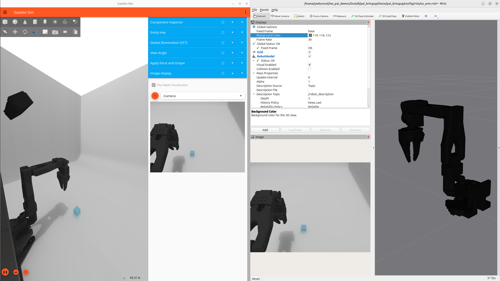

# ROS Physical AI Demos

## Requirements
- [Ubuntu 24.04](https://ubuntu.com/download/desktop)
- [ROS 2 Kilted Kaiju](https://docs.ros.org/en/kilted/)
- [Gazebo Ionic](https://gazebosim.org/docs/ionic/getstarted/)

> [!NOTE]
> ROS 2 `Jazzy Jalisco` is also supported but we recommend `Kilted` to benefit from simulation improvements in `Gazebo Ionic` which pairs with `Kilted` together with improvements in `ros2_control`.

## Install

```bash
sudo apt update && sudo apt install upgrade -y
mkdir ~/ws_pai/src -p && cd ~/ws_pai/src
git clone https://github.com/ros-physical-ai/demos
vcs import . < demos/pai.repos --recursive
cd ~/ws_pai
rosdep install --from-paths src --ignore-src --rosdistro kilted -yir
source /opt/ros/kilted/setup.bash
colcon build --cmake-args -DCMAKE_BUILD_TYPE=Release
```

> [!NOTE]
> We strongly recommend relying on [rmw_zenoh](https://github.com/ros2/rmw_zenoh) as the ROS 2 middleware.
It can be installed via `sudo apt install ros-kilted-rmw-zenoh-cpp`.
To switch to `rmw_zenoh` at runtime, `export RMW_IMPLEMENTATION=rmw_zenoh_cpp` in your terminals.
Also ensure the Zenoh router is started by running `ros2 run rmw_zenoh_cpp rmw_zenohd`.

## Demos

### Demo 1: Pick and Place with SO-ARM


A simple demonstration of training and running a policy with an SO-ARM in sim and real.

#### Launch the Gazebo world



```bash
source ~/ws_pai/install/setup.bash
ros2 launch pai_bringup so_arm_gz_bringup.launch.py
```

For instructions on training a policy and running inference see [this guide](./docs/so_arm_demo.md).
