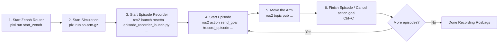

# pai_data_collection

Data collection tools for Physical AI demos using [rosetta](https://github.com/iblnkn/rosetta).

## Requirements

This project uses [Pixi](https://pixi.sh/) for environment management. Make sure the workspace is set up following the [Development Guide](../docs/DEVELOPMENT.md).

The required external repos (`rosetta` and `rosetta_interfaces`) are included in `pai.repos` and will be fetched automatically during workspace setup:
```bash
vcs import external < pai.repos --recursive
```

> [!NOTE]
> The following commands assume you are inside a `pixi shell` session or that you are running via `pixi run`.
>  See the [Development Guide](../docs/DEVELOPMENT.md) for details.

## Recording Rosbag

This package provides a rosetta contract for the SO-ARM100 robot (`config/rosetta/so_arm100.yaml`).
Recording uses rosetta's `episode_recorder_launch.py` directly.

### Workflow

1. Run zenoh router on a separate terminal:
```bash
pixi run start_zenoh # ros2 run rmw_zenoh_cpp rmw_zenohd
```

2. Start simulation:
```bash
pixi run so-arm-gz # ros2 launch pai_bringup so_arm_gz_bringup.launch.py
```

3. Start the episode recorder (using rosetta's launch file with our contract):
```bash
ros2 launch rosetta episode_recorder_launch.py \
    contract_path:=$(ros2 pkg prefix pai_data_collection)/share/pai_data_collection/config/rosetta/so_arm100.yaml \
    bag_base_dir:=datasets/so_arm100/bags
```

4. Start episode:
```bash
ros2 action send_goal /record_episode \
    rosetta_interfaces/action/RecordEpisode "{prompt: 'move arm'}" --feedback
```

5. Move the arm:

You can directly use the forward position controller via topic:
```bash
# Home position (all zeros)
ros2 topic pub /forward_position_controller/commands std_msgs/msg/Float64MultiArray '{layout: {dim: [{label: joint, size: 6, stride: 1}]}, data: [0.0, 0.0, 0.0, 0.0, 0.0, 0.0]}' --rate 20

# Slight rotation and tilt
ros2 topic pub /forward_position_controller/commands std_msgs/msg/Float64MultiArray '{layout: {dim: [{label: joint, size: 6, stride: 1}]}, data: [0.2, -0.4, 0.0, 0.0, 0.0, 0.4]}' --rate 20
```

There is simple script to run some of these commands sequentially:
```bash
$(ros2 pkg prefix pai_data_collection)/share/pai_data_collection/scripts/arm_demo_positions.sh
```

6. Finish episode: Cancel the action goal (Ctrl+C in the terminal where `send_goal` was run, or use an action client to cancel).

This will save a rosbag that corresponds to that episode.

7. Record more episodes: Repeat steps 4, 5, 6.

#### Workflow Overview




## Convert Rosbag to LeRobot

The contract (`so_arm100.yaml`) specifies `unit_conversion: rad2deg` in the action's `from_tensor` section, which automatically converts ROS radians to LeRobot degrees during conversion.

```yaml
# In the contract (config/rosetta/so_arm100.yaml):
actions:
  - key: action
    ...
    from_tensor:
      clamp: [-3.14159, 3.14159]
      unit_conversion: rad2deg  # Converts radians → degrees for LeRobot
```

Run conversion:
```bash
python -m rosetta.port_bags \
    --raw-dir datasets/so_arm100/bags \
    --contract $(ros2 pkg prefix pai_data_collection)/share/pai_data_collection/config/rosetta/so_arm100.yaml \
    --repo-id move_arm \
    --root datasets_lerobot
```

### port_bags arguments

| Argument | Required | Description |
|----------|----------|-------------|
| `--raw-dir` | Yes | Directory containing bag subdirectories (each with `metadata.yaml`) |
| `--contract` | Yes | Path to rosetta contract YAML |
| `--repo-id` | No | Dataset name. Defaults to `--raw-dir` directory name |
| `--root` | No | Parent directory for datasets. Dataset saved to `root/repo-id` |
| `--push-to-hub` | No | Upload to HuggingFace Hub after conversion |
| `--vcodec` | No | Video codec (default: `libsvtav1`). Use `libx264` for faster encoding |

## Replay Dataset on Real Robot using LeRobot

Using local LeRobot dataset (from within the pixi environment):
```bash
lerobot-replay \
    --robot.type=so101_follower \
    --robot.port=/dev/ttyACM0 \
    --robot.id=my_awesome_arm \
    --dataset.repo_id=move_arm \
    --dataset.root=datasets_lerobot/move_arm \
    --dataset.episode=0 \
    --robot.use_degrees=true \
    --play_sounds=false
```

**Important flags:**
- `--robot.use_degrees=true` - Required because the dataset contains degree values (from `unit_conversion: rad2deg` in the contract)
- `--play_sounds=false` - Disable audio feedback (avoids `spd-say` errors)
